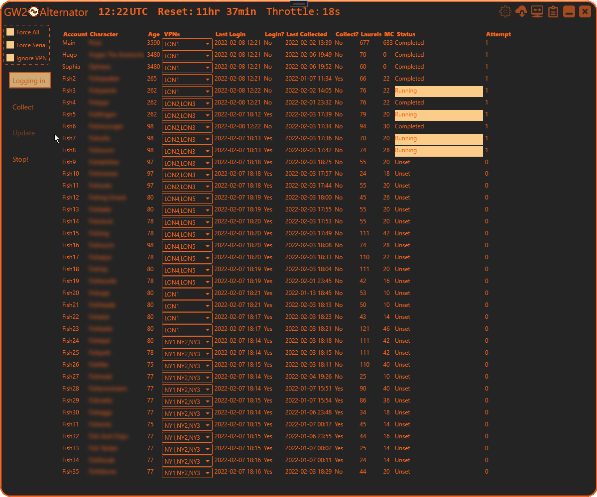
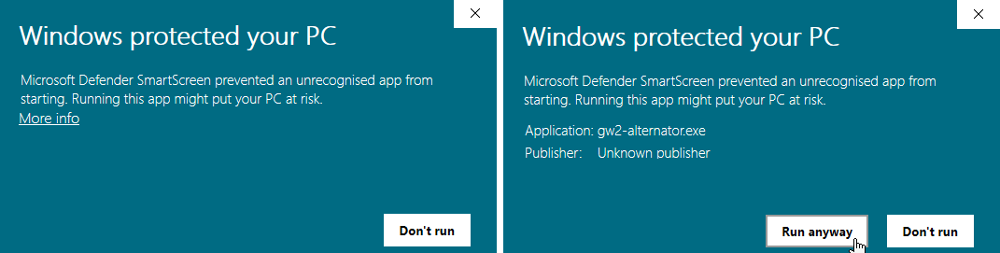
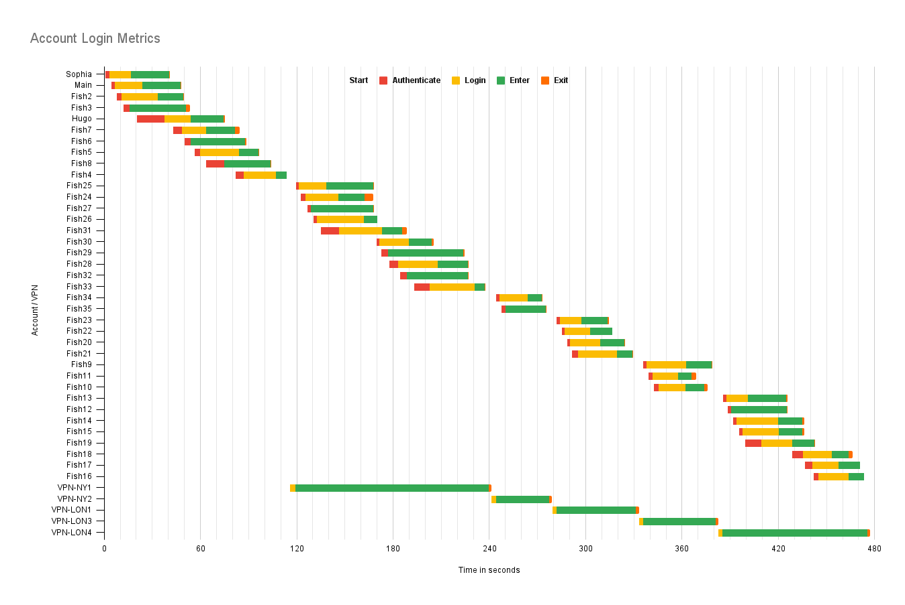
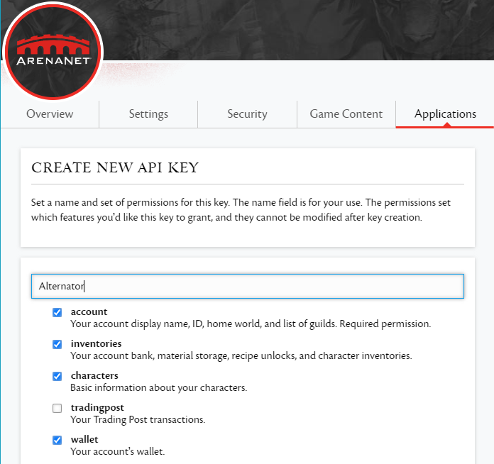
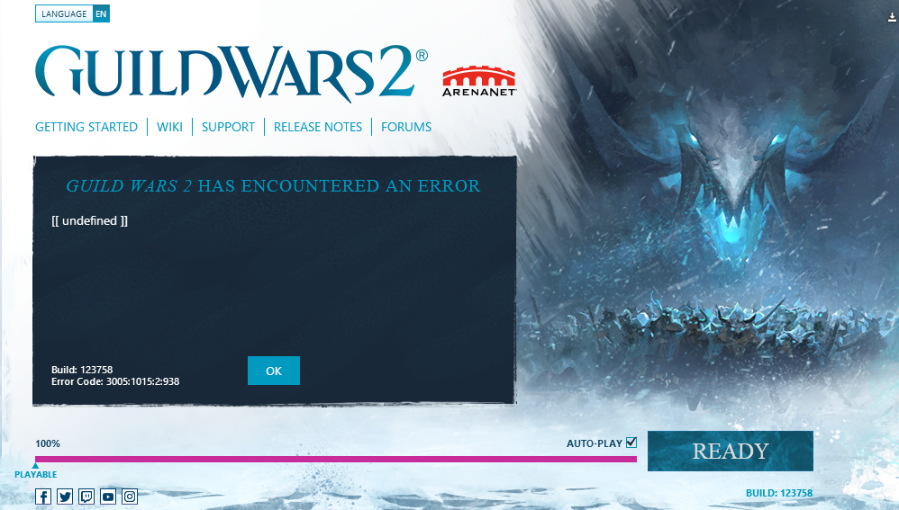

# gw2-alternator
(If anybody wants to help I would be delighted!)

Tool to help logging-in to multiple Guild Wars 2 alt accounts so as to harvest the [daily rewards](https://wiki.guildwars2.com/wiki/Login_rewards).

## Requires at least [.Net 6.0.2](https://dotnet.microsoft.com/en-us/download/dotnet/6.0)

## Features:
 * Import account details from GW2Launcher and/or GW2Launchbuddy
 * Automatically login to accounts with no user input
   * Will retry automatically on failure
 * Assist with collection of rewards every few days
 * Application has no access to your GW2 authentication details
 * Whilst you can still use your PC while this is running focus will constantly be stolen and this can be annoying

## Getting Started
 * On first launch you will see a security warning
   * Click "More info" then "Run Anyway"

   * This is because it is too expensive to sign executables, sadge
 * On application launch you will be asked to confirm admin access
   * This is so symbolic links can be created (similar to GW2LaunchBuddy)
 * If you have no accounts defined then go to settings and import from GW2Launcher and/or GW2Launchbuddy
 * Hit Login to login to all the accounts
   * Only accounts not logged-in that day will launch (unless you click Force all or make a selection)
   * If you have > 20 accounts expect that some will fail (they will retry automatically)
   * The first character on the account will be automatically selected, this will be the one that logged in most recently
 * You can select accounts if you just want to launch a subset, this will ignore the date filtering
   * Use CTRL-click to unselect
 * To harvest it is best not to run the Login step that day as this may trigger ArenaNet's login throttling

 ## Working with Multiple Accounts
 * ArenaNet's anti-botting measures tend to make dealing with more than 10 accounts difficult
   * There is a hard limit of 40 accounts from a single IP address, resets every 8 hours
 * Use email aliases to set-up your accounts : https://support.google.com/a/users/answer/9308648?hl=en
 * Logging into many (>10? ) accounts on https://www.guildwars2.com/ may cause a lockout that takes 24 hours to clear
   * /!\ Something went wrong. Please try again in a few minutes
   * Speculation: This is linked to using email aliases
   * Using a VPN seems not to help here
 * Logging into the game will become slower after multiple (>10?) accounts and may block entirely
   * Using a VPN will help
   * Waiting a few minutes (5?) will help
   * GW2-Alternator tries to counter this by slowing down the login attempts after a failure
     * However the delay required depend on the past login history and is difficult to guess
     * There are tuning parameters in Settings to help adjust this
 * To update the GW2 settings for accounts
   * Check Force Serial
   * Check Ignore VPN
   * Select some accounts
   * Use the Collect button

## Advanced
 * Settings, Account details, metrics and logs are found here: %AppData%\gw2-alternator

[Google Doc](https://docs.google.com/spreadsheets/d/1wrKWp_2dLXHZrtC2WtUN2d-j0Z8Fl4EqnV_mO9Up72E/edit?usp=sharing)

### GW2 API Key
 * Given a GW2 API key then Laurels and Mystic Coins will be counted (includes an estimate from unclaimed reward chests)
   * Account/Inventories/Characters/Wallet

 

### VPN
 * If you create manual VPN configurations in Windows then alternator can be configured these automatically
   * Ensure that the connection is a static IP or restricted to 255.255.255.0 subnet (for smooth GW2 authentication)
   * [Shark VPN instructions](https://support.surfshark.com/hc/en-us/articles/360003144894-How-to-set-up-an-IKEv2-connection-manually-on-Windows-)
     * [Mighty Teapot Referral](http://surfshark.deals/MightyTeapot)

### Login Errors
 * Typical errors you may see
   * Fixes
     * Wait 5 minutes
     * Use a VPN

## Credits:
* GW2 Launchbuddy https://github.com/TheCheatsrichter/Gw2_Launchbuddy
* GW2Launcher https://github.com/Healix/Gw2Launcher
* GW2 API access using GW2Sharp https://github.com/Archomeda/Gw2Sharp
* MVVM async using https://github.com/brminnick/AsyncAwaitBestPractices
* MVVM Dialogs using https://github.com/FantasticFiasco/mvvm-dialogs
* Logging using NLog https://nlog-project.org/
* Unit Testing using xUnit https://xunit.net/ and FluentAssertions https://fluentassertions.com/
* Main icon by https://www.flaticon.com/authors/ingmixa
* Other icons from: https://www.iconsdb.com/ with color: #FB651D This site is so good :)
